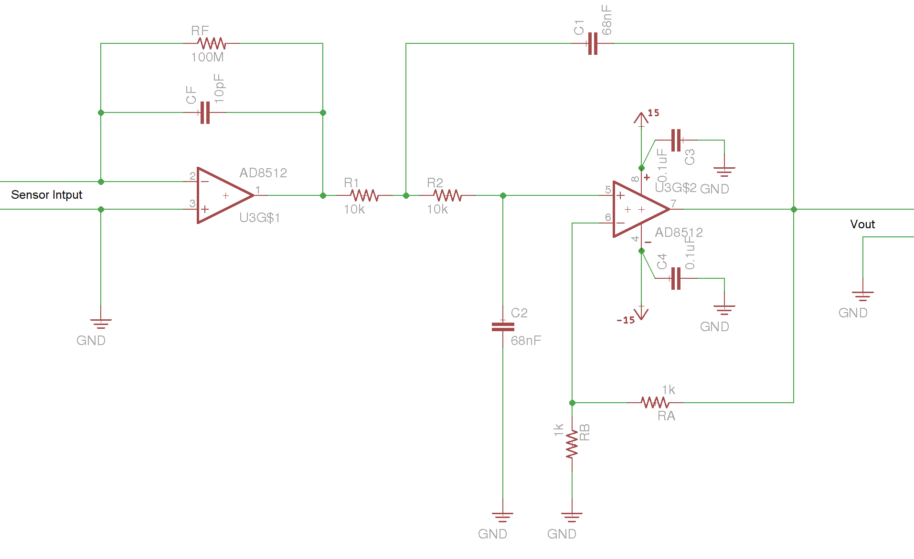

# Piezofilm Amplifier
This simple circuit was created for [TENSS 2018](http://www.tenss.ro/). It is a
little amplifier circuit for [piezo vibration
sensors](https://www.sparkfun.com/products/9196).  It is low-cost means to
detect rodent whisking events in freely moving animals.

## Design
The circuit is a charge amplifier followed by a second order low-pass filter.
Therefore, the output is a bandpass filtered measurement of the charge
accumulation on the sensor due to motion.  The only special thing about it is
that the feedback capacitance is kept small (10 pF) in order to increase the
charge amplifier's sensitivity to tiny motions in the sensor. The parallel
feedback resistance is very large to prevent the small capacitance from
resulting in a high frequency cutoff that is too large for detecting whisker
induced defections. The J-FET amplifier's has very high input impedance and low
input bias current. These properties allow it to work with these extreme values
without (1) loading the sensor itself and (2) leading to saturation in the
output due to bias currents charging the capacitor at a rate that exceeds
compensation through the feedback resistor, respectively.

The charge-to-voltage conversion gain of the first stage is given by:

$$ K_1 = 1 / C_f $$

where $C_f$ is the feedback capacitance. The high-pass cutoff of the charge
amplifier is given by

$$ f_{high} = 1 / (2 \pi R_f C_f ) $$

where $R_f$ is the feedback resistance. With the values in this circuit, this
works out to 159Hz (TODO: This is too high, raise $C_f$ and increase second
stage gain). The passband gain of the low-pass filter that follows the charge
amplifier is given by

$$ K_2 = 1 + R_A / R_B $$

where $R_{A, B}$ are the values of resistors in the voltage dividers
forming the feedback network for the op-amp. This works out to 2 in the
current circuit. The low-pass cutoff is given by

$$ f_{low} = 1/(2 \pi \sqrt{R_1 R_2 C_1 C_2 } $$

This works out to 234 Hz in the current circuit. This is just above the upper
end of the 180 Hz resonant frequency response for the [LDT0-028K
](https://www.digikey.com/product-detail/en/te-connectivity-measurement-specialties/1002794/MSP1006-ND/279646)
piezofilm sensor.

## Bill of Materials
The BOM is available on [this google doc](https://docs.google.com/spreadsheets/d/1n-XtDbyPefXFcR3jt2YO9uInEOwsC4XHhL0OOs0oTnM/edit?usp=sharing).

## Usage
- 9V batteries can be connected to the bottom or power can be provided through
  the middle screw terminal. Use something in the range of +/- 18V.
- The switch turns the amplifier on.
- The output comes from the right most screw terminal.
- Input can be provided through either the screw terminal (Input B) or 0.1"
  pitch socket (Input A). These are connected internally, so only use one.
- To use it with freely moving animals, the PCB must not be rigidly attached to
  the behavior arena -- it will readily pick up vibrations due to the animal
  running around.  Instead, it must be mechanically decoupled from the
  environment. A good solution is to mount the PCB on a heavy object (e.g. a
  steel plate), and then place that assembly on a cushion made of [twist
  ballons](https://www.balloonstomorrow.com/images/Animal-Balloons-Main-Graphic.png).
  The piezofilm sensor can then extend through the elevated floor of an arena
  via a hole.
